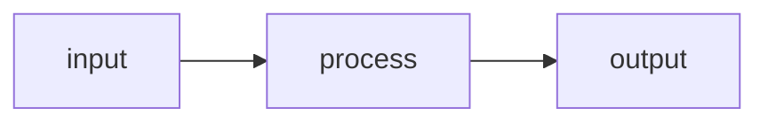

# Recipe: <% tp.file.title %>

## Relation

- Input:
- Process:
- Machine:
- Output:

## Flowchart



## Inputs

| Item | Count | Kind | Role |
|---|---:|---|---|

## Outputs

| Item | Count | Chance | Kind | Role |
|---|---:|---:|---|---|

## Raw JSON

```json
{}
```
